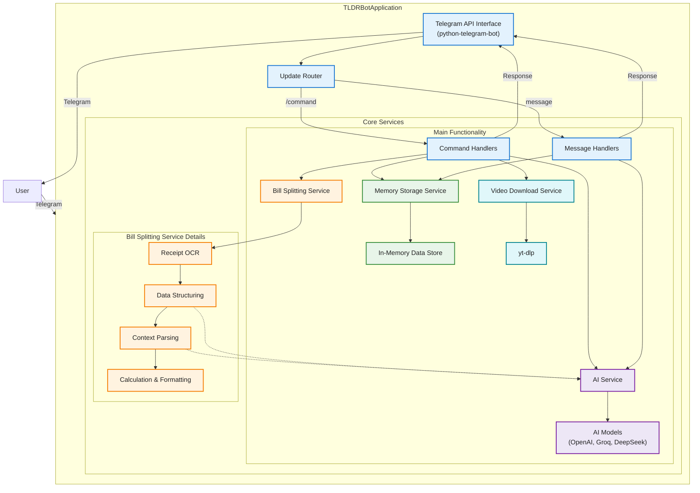

# TLDRBot

A powerful Telegram bot that enhances group productivity through AI-powered conversation management, bill splitting, and media handling. Built with Python and modern AI models, TLDRBot helps teams stay organized and efficient in their group chats.

## 🌟 Key Features

### 1. Smart Conversation Management
- **AI-Powered Summaries**: Use `/tldr` to get concise summaries of recent chat messages
  - Extracts key points, sentiment, and events
  - Configurable message range (default: 50, max: 400)
  - Supports multiple AI models for different quality/performance needs

### 2. Context-Aware Q&A
- Reply to any summary with questions
- Bot provides answers based on the conversation context
- Maintains conversation memory for accurate responses

### 3. Intelligent Bill Splitting
- **Receipt Processing**: Upload receipt photos with payment context
- **Smart OCR**: Uses Mistral AI for accurate text extraction
- **Flexible Payment Matching**:\
  Individual items: "Alice: Burger, Bob: Salad"\
  Shared items: "Shared: Drinks"\
  Automatic tax and service charge calculations
- **Interactive Flow**: Confirmation steps to ensure accuracy

### 4. Media Handling
- **Video Downloads**: `/dl` command for short-form videos
  - Supports TikTok, YouTube Shorts, Instagram Reels
  - Direct download in chat
  - Powered by yt-dlp for reliable downloads

### 5. Multi-Model AI Support
- Switch between different AI models:
  - OpenAI (GPT models)
  - Groq (Llama 3)
  - DeepSeek
- Use `/switch_model` to change models based on needs

## 🛠️ Technical Architecture

### Core Components

1. **Command Handlers**
   - Manages all bot commands
   - Implements conversation flows
   - Handles user interactions

2. **Message Handlers**
   - Processes regular messages
   - Manages context-aware responses
   - Handles reply chains

3. **AI Service**
   - Strategy pattern for multiple AI models
   - Handles summarization and Q&A
   - OCR processing for receipts

4. **Memory Storage**
   - In-memory message storage
   - Efficient chat history management
   - No persistent database required

5. **Bill Splitting System**
   - **Receipt Processing Pipeline**:
     - OCR using Mistral AI for text extraction
     - AI-powered receipt data structuring
     - Pydantic models for data validation
   
   - **Context Analysis**:
     - LLM-based payment context parsing
     - Smart item-to-person matching
     - Shared item detection
   
   - **Calculation Engine**:
     - Proportional tax and service charge distribution
     - Individual and shared item cost calculations
     - Validation against receipt totals
   
   - **Conversation Flow**:
     - Multi-step confirmation process
     - Error handling and recovery
     - User-friendly result formatting

### System Flow



### Technology Stack
- **Core**: Python 3.10+
- **Telegram Integration**: python-telegram-bot
- **AI Models**: 
  - OpenAI API
  - Groq API (Llama 3)
  - DeepSeek API
- **OCR**: Mistral AI
- **Video Processing**: yt-dlp
- **Data Validation**: Pydantic
- **Async Support**: asyncio, aiohttp

## 🚀 Getting Started

### Prerequisites
- Python 3.10 or higher
- Telegram Bot Token
- API keys for desired AI services

### Installation
1. Clone the repository:
   ```bash
   git clone https://github.com/yourusername/TeleBot.git
   cd TeleBot
   ```

2. Create and activate virtual environment:
   ```bash
   python -m venv .venv
   source .venv/bin/activate  # On Windows: .venv\Scripts\activate
   ```

3. Install dependencies:
   ```bash
   pip install -r requirements.txt
   ```

4. Set up environment variables:
   ```bash
   # Required
   BOT_TOKEN=your_telegram_bot_token
   
   # Optional (based on AI models you want to use)
   OPENAI_API_KEY=your_openai_key
   GROQ_API_KEY=your_groq_key
   DEEPSEEK_API_KEY=your_deepseek_key
   MISTRAL_API_KEY=your_mistral_key
   
   # Optional (for webhook deployment)
   WEBHOOK_URL=your_webhook_url
   PORT=your_port
   ```

5. Run the bot:
   ```bash
   python -m bot.main
   ```

## 📝 Usage Guide

### Basic Commands
- `/help` - Show all available commands
- `/tldr [number]` - Summarize last N messages
- `/splitbill` - Start bill splitting process
- `/dl <url>` - Download short-form video
- `/switch_model <model>` - Change AI model
- `/cancel` - Cancel current operation

### Bill Splitting Flow
1. Send `/splitbill`
2. Upload receipt photo
3. Add caption with payment context
4. Confirm or cancel the split

### Model Switching
Available models:
- `openai` - OpenAI's GPT models
- `groq` - Groq's Llama 3
- `deepseek` - DeepSeek models

## 🔧 Development

### Project Structure
```
TeleBot/
├── bot/
│   ├── config/         # Configuration settings
│   ├── handlers/       # Command and message handlers
│   ├── services/       # Core services (AI, Telegram)
│   ├── utils/          # Utility functions
│   └── main.py         # Bot entry point
├── requirements.txt    # Dependencies
└── README.md          # Documentation
```

### Extending the Bot
1. **New Commands**:
   - Add handler in `bot/handlers/command_handlers.py`
   - Register in `bot/main.py`

2. **New AI Models**:
   - Implement strategy in `bot/services/ai/`
   - Add to strategy registry

3. **Persistent Storage**:
   - Replace `MemoryStorage` with database implementation
   - Update storage interface

## 🤝 Contributing
Contributions are welcome! Please feel free to submit a Pull Request.

## 📄 License
This project is licensed under the MIT License - see the LICENSE file for details.
