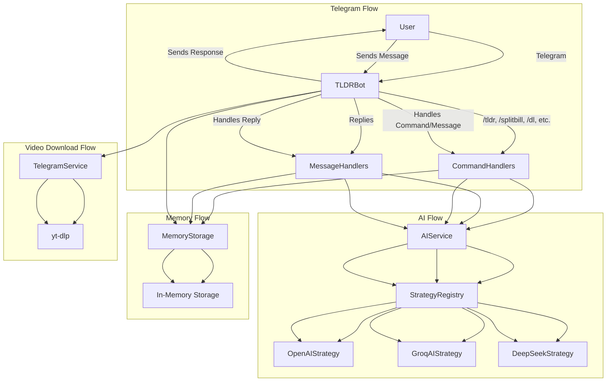

# TLDRBot

A Telegram bot for summarizing conversations, answering context-aware questions, splitting bills from receipts, and downloading short-form videos. Powered by multiple AI models and designed for group productivity.

---

## Features

- **Conversation Summarization:**
  Use `/tldr` to generate concise summaries of recent chat messages, including sentiment and event extraction.

- **Contextual Q&A:**
  Reply to a summary with a question to get context-aware answers based on the summarized conversation.

- **Bill Splitting from Receipts:**
  Use `/splitbill` to upload a receipt photo and caption who paid for what. The bot uses OCR and AI to extract items, match them to people, and calculate who owes what, including service charge and tax.

- **Short Video Downloading:**
  Use `/dl <url>` to download TikTok, YouTube Shorts, Instagram Reels, and similar videos directly in chat.

- **Multi-Model AI Support:**
  Switch between OpenAI, Groq (Llama 3), and DeepSeek models for summaries and Q&A with `/switch_model`.

- **In-Memory Message Storage:**
  Efficiently stores recent messages per chat for fast summarization (no persistent database required).

---

## Usage

### Commands

- `/tldr [number]`
  Summarize the last `[number]` messages (default: 50, max: 400).

- `/splitbill`
  Start a bill-splitting flow. Send a receipt photo with a caption (e.g., `Alice: Burger, Bob: Salad, Shared: Drinks`).

- `/dl <url>`
  Download a short-form video from TikTok, YouTube Shorts, Instagram Reels, etc.

- `/switch_model <model>`
  Switch the AI model for summaries and Q&A. Available: `openai`, `groq`, `deepseek`.

- `/help`
  Show help and feature overview.

- `/cancel`
  Cancel the current operation (e.g., bill splitting).

---

## Architecture



---

## Technology Stack

- **Python 3.10+**
- **python-telegram-bot** for Telegram API
- **OpenAI, Groq, DeepSeek** for AI-powered summarization and Q&A
- **yt-dlp** for video downloads
- **Mistral OCR** for receipt image parsing
- **Pydantic** for robust data validation

---

## Environment Variables

- `BOT_TOKEN` (Telegram Bot Token, required)
- `OPENAI_API_KEY` (for OpenAI model)
- `GROQ_API_KEY` (for Groq Llama 3)
- `DEEPSEEK_API_KEY` (for DeepSeek)
- `MISTRAL_API_KEY` (for OCR in bill splitting)
- Optional: `WEBHOOK_URL`, `PORT`, etc.

---

## Setup

1. Clone the repository and install dependencies:
   ```
   pip install -r requirements.txt
   ```
2. Set environment variables (see above).
3. Run the bot:
   ```
   python -m bot.main
   ```

---

## Extending

- Add new AI strategies in `bot/services/ai/`.
- Add new commands in `bot/handlers/command_handlers.py`.
- For persistent storage, replace `MemoryStorage` with a database-backed implementation.

---

## License

MIT License
