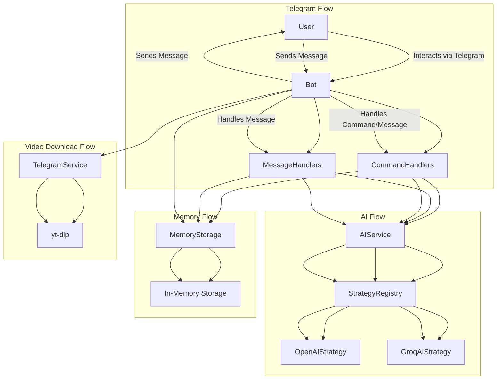

# tldrbot

## Commands:
/tldr : Summarises past 50 messages
/tldr x : Summarises past x messages
/dl x: Download videos at the link provided (e.g. TikTok, Youtube Shorts, Instagram Reels, etc.)

## Architecture:

