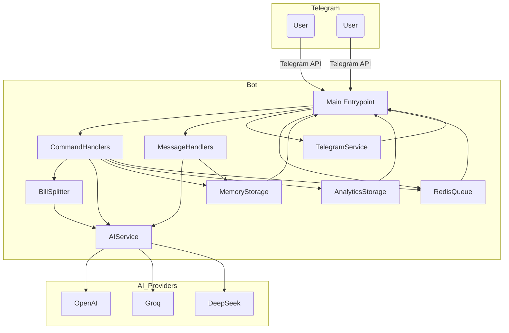
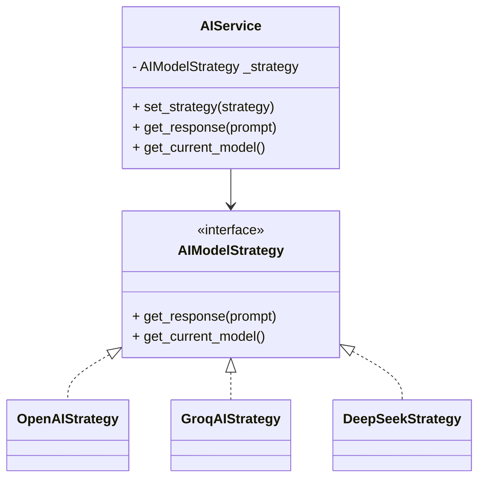
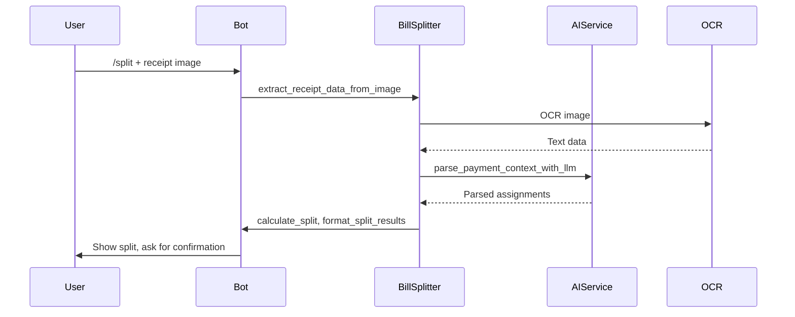
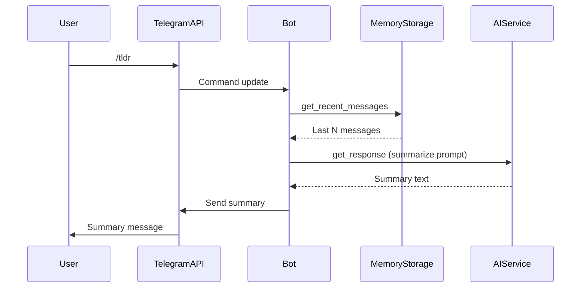
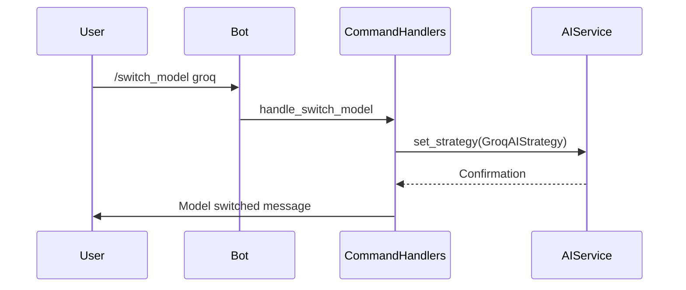
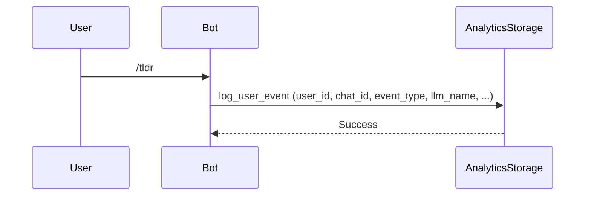

# TeleBot Architecture

## Overview

TeleBot is a modular, AI-powered Telegram bot designed for group productivity, featuring conversation summarization, bill splitting, and media handling. The architecture emphasizes extensibility, separation of concerns, and support for multiple AI providers.

---

## High-Level Architecture



---

## Component Breakdown

### 1. Main Entrypoint (`main.py`)

- Initializes all core services and handlers.
- Registers command and message handlers with the Telegram application.
- Manages the event loop and background workers (e.g., for LLM jobs).

### 2. Command Handlers

- Handle bot commands (e.g., `/tldr`, `/split`, `/dl`, `/switch_model`).
- Orchestrate conversation flows and interact with services.
- Log analytics events.

### 3. Message Handlers

- Process regular chat messages and replies.
- Manage context-aware responses (e.g., follow-up questions on summaries).
- Interface with memory storage for chat history.

### 4. AI Service (Strategy Pattern)

- Abstracts multiple AI providers (OpenAI, Groq, DeepSeek).
- Selects and switches models dynamically per user or chat.
- Handles summarization, context parsing, and OCR tasks.



### 5. Memory Storage

- In-memory storage of recent messages per chat (up to 400).
- Stores summary context for follow-up Q&A.
- Fast, ephemeral; not persisted across restarts.

### 6. Analytics Storage

- SQLAlchemy-based persistent logging of user events.
- Stores command usage, LLM model used, and metadata for analytics.

### 7. Bill Splitting System

- **Receipt Processing Pipeline**:
    - Receives image uploads.
    - Uses OCR (OpenAI GPT-4o) to extract text.
    - Parses payment context using LLM.
    - Calculates and formats split results.
- Interactive confirmation flow with users.



### 8. Telegram Service

- Handles media downloads (e.g., TikTok videos).
- Sends files and messages back to users.

### 9. Redis Queue

- Asynchronous job queue for LLM tasks.
- Decouples heavy AI processing from main event loop.

---

## Data Flow: Conversation Summarization



---

## Data Flow: Model Switching



---

## Data Flow: Analytics Logging



---

## Extensibility

- **AI Providers**: Add new strategies by implementing `AIModelStrategy` and registering in `StrategyRegistry`.
- **Commands**: Add new command handlers in `handlers/command_handlers.py`.
- **Persistence**: Swap in-memory storage for persistent DB by extending `MemoryStorage`.
- **Analytics**: Extend `UserEvent` model for richer analytics.

---

## Environment & Configuration

- All secrets and config are loaded from environment variables (see `config/settings.py`).
- Supports BYOK (Bring Your Own Key) for user-specific LLM API keys.

---

## Directory Structure (Key Parts)

```
TeleBot/
  bot/
    main.py                # Entrypoint
    handlers/              # Command and message handlers
    services/
      ai/                  # AI strategies and service
      bill_splitter.py     # Bill splitting logic
      telegram_service.py  # Media handling
      redis_queue.py       # Async job queue
    utils/
      memory_storage.py    # In-memory chat storage
      analytics_storage.py # Persistent analytics
      text_processor.py    # Markdown/text helpers
      user/                # User API key management
    config/
      settings.py          # Environment/config management
    data/
      database.sqlite      # SQLite DB (if used)
```

---

## Summary

TeleBot's architecture is modular, extensible, and designed for robust group chat productivity. The use of strategy patterns, clear separation of concerns, and asynchronous processing ensures maintainability and scalability for future features and AI integrations.