## Product Requirements Document (PRD)

**Feature:** Freemium + Stripe Subscription Upgrade for TLDRBot
**Owner:** *(you)* | **Engineer:** *(assignee)* | **Target Release:** *(T + 4 weeks)*

---

### 1 . Purpose & Goals

| Goal                                                                     | Success Metric                                            |
| ------------------------------------------------------------------------ | --------------------------------------------------------- |
| Monetise heavy users while keeping a generous free tier                  | ≥ 10 % of monthly active users on Premium within 60 days  |
| Provide friction-free upgrade inside Telegram                            | ≥ 70 % of checkout sessions start from bot inline buttons |
| Prevent freeloading without degrading experience for others in the group | ≤ 1 % support tickets about “bot stopped working”         |

---

### 2 . User Segments

* **Free User** – Casual; ≤ 5 summaries/day, ≤ 100/month, ≤ 3 groups.
* **Premium User** – Pays **US \$ 5 / month**; unlimited summaries & groups.
* **Group Sponsor** *(future)* – Optional tier to unlock bot for entire chat (not in MVP).

---

### 3 . Functional Requirements

#### 3.1 Usage Tracking

| ID  | Requirement                                                                                                                                      |
| --- | ------------------------------------------------------------------------------------------------------------------------------------------------ |
| F-1 | Track summary usage **per Telegram user-ID**, independent of chat context.                                                                       |
| F-2 | Enforce limits: `daily=5`, `monthly=100`, `group_count=3` for Free tier.                                                                         |
| F-3 | Reset daily counters at 00:00 Asia/Singapore; reset monthly on the 1st.                                                                          |
| F-4 | Premium users bypass all quota checks.                                                                                                           |
| F-5 | Hard-block an over-quota command, delete it in the group, immediately **DM** the user with upgrade CTA (max 1 DM/15 min per user to avoid spam). |
| F-6 | Other group members continue to use bot normally (per-user isolation).                                                                           |

#### 3.2 Stripe Integration

| ID  | Requirement                                                                                                        |
| --- | ------------------------------------------------------------------------------------------------------------------ |
| P-1 | Use existing **Stripe Payment Link** (recurring \$5/month).                                                        |
| P-2 | Handle `checkout.session.completed` (one-time) and `customer.subscription.updated` (lifecycle) web-hooks.          |
| P-3 | On successful payment or renewal, mark `user_id` as **premium=true** with `expires_at` timestamp.                  |
| P-4 | If a subscription expires or is cancelled, revert user to Free tier immediately after Stripe notifies via webhook. |
| P-5 | Failure handling: if webhook fails >3×, alert via Sentry & Slack.                                                  |

#### 3.3 Bot Commands & UX

| ID  | Requirement                     | Copy / Behaviour                                                                                                                                                                      |
| --- | ------------------------------- | ------------------------------------------------------------------------------------------------------------------------------------------------------------------------------------- |
| U-1 | `/help`                         | Append **Account & Usage** section. Dynamically show: `Today: X/5 · Month: Y/100 · Groups: G/3 (Free)` **or** `✅ Premium user (unlimited)`. Include: “Upgrade anytime with /upgrade”. |
| U-2 | `/upgrade` (alias `/subscribe`) | In private chat, send Premium pitch + **InlineKeyboardButton** → `STRIPE_PAYMENT_LINK`.                                                                                               |
| U-3 | `/usage`                        | Mirror quota line used in /help (see U-1).                                                                                                                                            |
| U-4 | Limit-hit DM                    | > 🔒 *Free limit reached (5/day).*  Upgrade for unlimited summaries → **\[💳 Subscribe \$5/mo]**                                                                                      |
| U-5 | First-time welcome              | After first summary: small footer “You’re on the free plan (5/day). Use /upgrade for unlimited 🚀.”                                                                                   |

---

### 4 . System Design

#### 4.1 Data Model (PostgreSQL)

```text
users (
  telegram_id BIGINT PRIMARY KEY,
  premium      BOOLEAN DEFAULT FALSE,
  premium_expires_at TIMESTAMP,
  stripe_customer_id TEXT,
  created_at TIMESTAMP DEFAULT now()
);

usage_counters (optional long-term storage)
  -- daily/monthly counts can be aggregated from analytics; not required in MVP
```

#### 4.2 Caching / Runtime Quota Store (Redis)

| Key                   | Type            | TTL                         |
| --------------------- | --------------- | --------------------------- |
| `usage:daily:<uid>`   | INT             | 24 h at 00:00 reset         |
| `usage:monthly:<uid>` | INT             | Expire on 1st 00:05         |
| `groups:<uid>`        | SET             | No TTL (clear on downgrade) |
| `dm_throttle:<uid>`   | INT (timestamp) | 15 min                      |

#### 4.3 Command Flow (Pseudo)

```python
def handle_tldr(update):
    uid = update.from_user.id
    if is_premium(uid):
        return summarize()

    if not within_quota(uid, update.chat.id):
        block_and_dm(uid, update)
        return
    increment_counters(uid, update.chat.id)
    summarize()
```

#### 4.4 Webhook Flow

```mermaid
sequenceDiagram
  Stripe->>WebhookServer: checkout.session.completed
  Note over WebhookServer: Verify signature
  WebhookServer->>Postgres: INSERT/UPDATE users.premium=true<br/>premium_expires_at=period_end
  WebhookServer-->>TelegramBot: "activatePremium(uid)"
  TelegramBot->>User: 🎉 You are now Premium!
```



---

### 5 . Non-Functional Requirements

| NFR | Target                                                                    |
| --- | ------------------------------------------------------------------------- |
| N-1 | Quota check ≤ 50 ms p99 (Redis lookups only).                             |
| N-2 | Webhook reliability: ≥ 99.9 % delivered & processed.                      |
| N-3 | GDPR-safe: store only Telegram ID, not usernames.                         |
| N-4 | Clear logs & metrics for `limit_hit`, `upgrade_click`, `payment_success`. |
| N-5 | Unit tests: ≥ 90 % coverage for quota logic & webhook handlers.           |

---

### 6 . Environment & Secrets

| Var                     | Example                           |
| ----------------------- | --------------------------------- |
| `STRIPE_PAYMENT_LINK`   | `https://buy.stripe.com/abcd1234` |
| `STRIPE_WEBHOOK_SECRET` | `whsec_…`                         |
| `REDIS_URL`             | `redis://…`                       |
| `BOT_TOKEN`             | `123:ABC…`                        |
| `ENV=production`        | –                                 |

---

### 7 . Edge Cases & Error Handling

1. **User never started bot privately** → DM fails → fall back to replying in-group but *only once per 15 min*.
2. **Redis down** → default to *block* (fail-safe) and log critical error.
3. **Webhook signature mismatch** → HTTP 400, do not activate premium, alert devs.
4. **Subscription ends mid-session** → next command triggers downgrade check.

---

### 8 . Analytics & KPIs

* `daily_active_free`, `daily_active_premium`
* `free_limit_hits` / `unique_users`
* `checkout_clicks` ➜ `payment_success_rate`
* Churn: `(cancellations / active_premium)`

---

### 9 . Out of Scope (MVP)

* Group-level “sponsor” subscription
* “Degraded summary” teaser (approach 3)
* Proration and multi-currency pricing

---

### 10 . Acceptance Criteria

* [ ] Free users capped at 5/day, 100/month, 3 groups; Premium unlimited.
* [ ] Hard-block & DM flow works; group stays clean.
* [ ] `/help`, `/upgrade`, `/usage` show dynamic data.
* [ ] Stripe checkout → webhook → user premium flag updates within 30 s.
* [ ] Automated test suite passes; CI green.
* [ ] Metrics visible in Grafana dashboard.

---

### 11 . Timeline (T = Kick-off)

| Week     | Milestone                                   |
| -------- | ------------------------------------------- |
| T+0.5 wk | Redis quota prototype, unit tests           |
| T+1 wk   | Stripe webhook endpoint deployed to staging |
| T+2 wk   | Telegram command UX + inline buttons        |
| T+3 wk   | End-to-end flow in staging; QA & load test  |
| T+4 wk   | Prod rollout, monitor, tweak limits         |

---

**Hand-off:** This PRD plus the linked Stripe account credentials should give the engineer everything needed to implement the freemium upgrade feature end-to-end.

